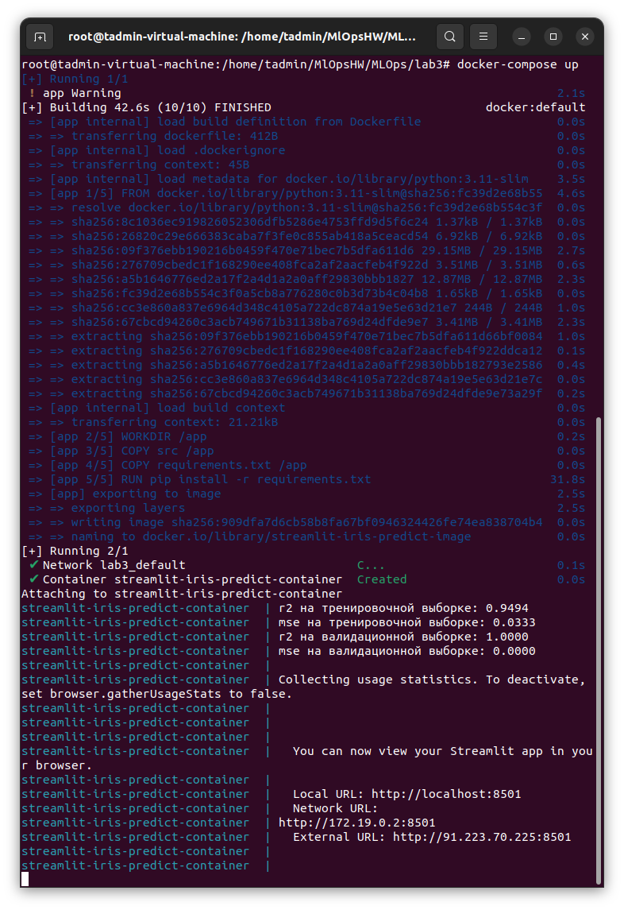

# EN
[![RU]](./README.ru.md)

# Laboratory work No. 3

Working with dokker and dokker-compose and creating microservices.

## File Description:
src/data_preprocessing.py - source data processing file
src/model_train.py
- model training file rc/model_train.py ' is an application using a trained model implemented on the streamlet
data/test/X_val framework.csv is a test dataset of features
data/test/y_val.csv is a test dataset of target values
data/train/X_train.csv is a training dataset of features
data/train/y_train.csv - training dataset of target values
model/Logistic Regression.pkl - saved in joblab
model/Standard Scale r.pkl - saved in joblab standardization pipeline
requirements.txt - a file with dependencies
Dockersfile - file Docker
docker-compose-.yaml - file docker-compose

## Running outside the container

1. Installing libraries
'''pip install -r requirements.txt'''
2. We perform preliminary processing of the initial data
''''''python 3 ./src/data_preprocessing.py'''
3. We train the model
'''python3 ./src/model_train.py'''
4. Launch the application
'''streamlit run src/main.py'''

## Docker

To run an application in a Docker container, run:
'''docker-compose up'''

The application will be available at
'http://localhost:8501/'