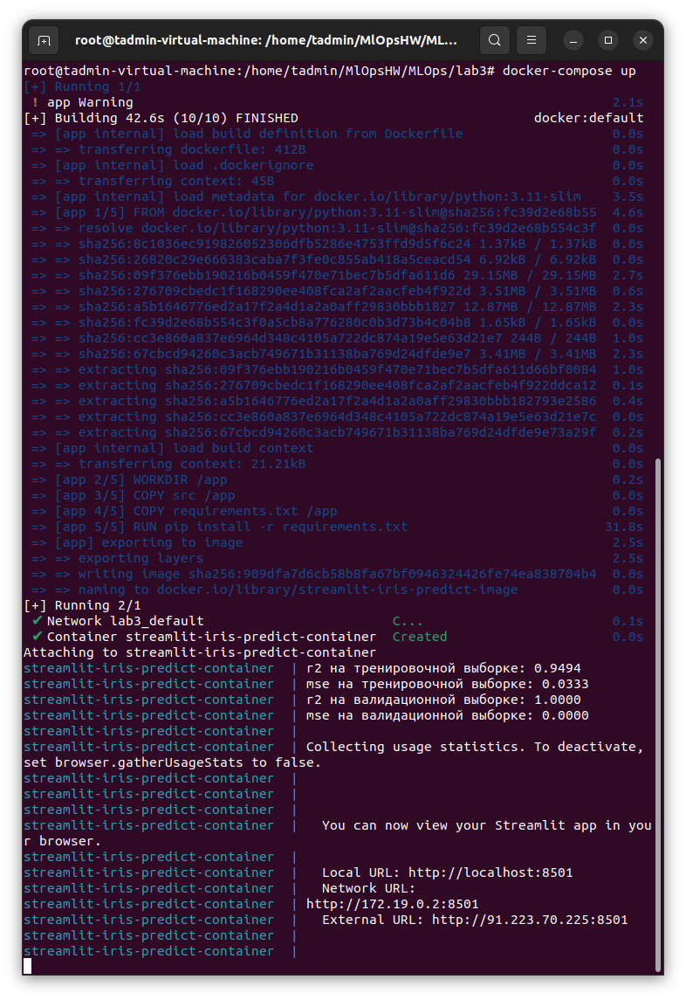

# RU
[![EN]](./README.md)

# Лабораторная работа №3

Работа с docker и docker-compose и создание микросервисов.

## Описание файлов:
* src/data_preprocessing.py - файл обработкиисходных данных
* src/model_train.py - файл обучения модели
* src/model_train.py' - приложение использующее натренированную модель реализованное на фрэймворке streamlit
* data/test/X_val.csv - тестовый датасет признаков
* data/test/y_val.csv - тестовый датасет целевых значений
* data/train/X_train.csv - тренировочный датасет признаков
* data/train/y_train.csv - тренировочный датасет целевых значений
* model/LogisticRegression.pkl - сохраненная в joblib модель
* model/StandartScaler.pkl - сохраненный в joblib пайплайн стандартизации
* requirements.txt - файл с зависимостями
* Dockersfile - файл Docker
* docker-compose.yaml - файл docker-compose

## Запуск вне контейнера

1. Устанавливаем библиотеки 
'''pip install -r requirements.txt'''
2. Выполняем предварительную обработку исходных данных
'''python3 ./src/data_preprocessing.py'''
3. Обучаем модель
'''python3 ./src/model_train.py'''
4. Запускаем приложение 
'''streamlit run src/main.py'''

## Docker

Для запуска приложения в контейнере Docker выполнить:
'''docker-compose up'''

Приложение будет доступно по адресу
'http://localhost:8501/'
