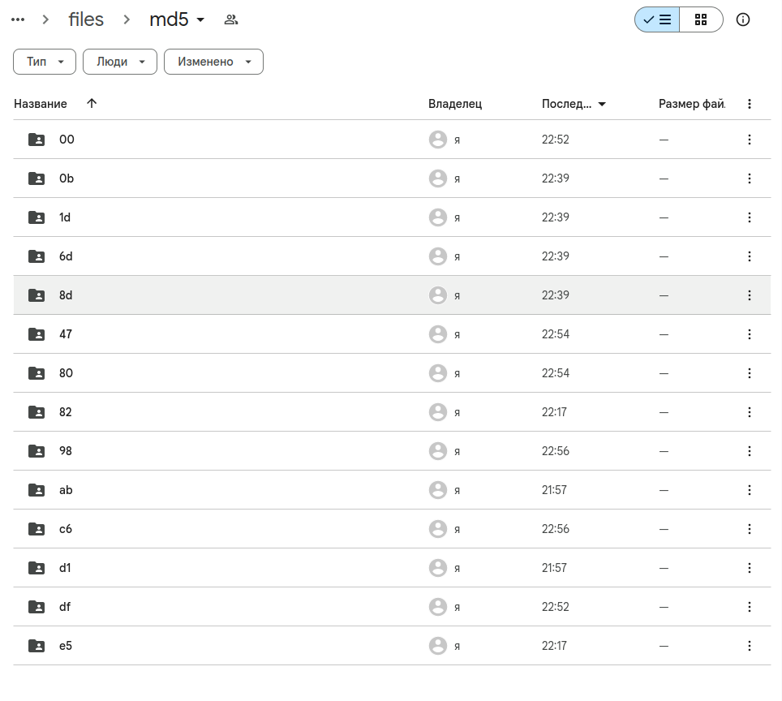

# EN
[![RU]](./README.ru.md)

# Laboratory work No. 4

Working with a DVC utility designed for data management.

## File Description:
* scripts/download_dataset.py - file for uploading the dataset;
* scripts/dataset_modif_age.py - the file fills in the gaps in the `Age` column with average values;
* scripts/dataset_add_one_hot_sex.py - the file performs one_hot encoding of the `Sex` column;

## Stages of work:

1. Preparing the dataset;
2. Enabling DVC tracking of the dataset;
3. Changing the dataset and saving the results using git+ dvc;
4. Switching between versions of datasets using git + svn;

We use it as a storage [Google Drive folder](https://drive.google.com/drive/folders/12KZSI3PtauAQHk53OXmrK7J5JI0nkwpB?usp=sharing)



The history of changes can be seen through the `git log --oneline`:

```shell
5099ecb  modified datasets one_hot_encoding
62453cc  modified Age mean
db71a5c  Modif dataset
7497140  Changes to be committed:       modified:   .dvc/config         new file:   lab4/scripts/dataset_add_one_hot_sex.py     new file:   lab4/scripts/dataset_modif_age.py   modified:   lab4/scripts/download_dataset.py
```

The versions of the dataset are stored in commits: `7497140`, `db71a5c`, `62453cc` and `5099ecb`.

Switching between commits is performed by the command `git checkout <commit-id>'.
To load the dataset, you must perform a 'dvc pull`.

To return to the latest version:
```shell
git checkout master
dvc pull
```